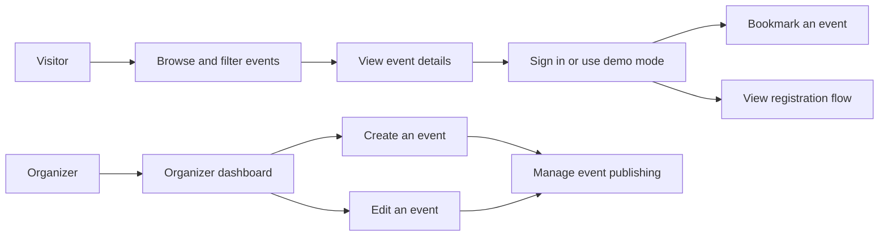
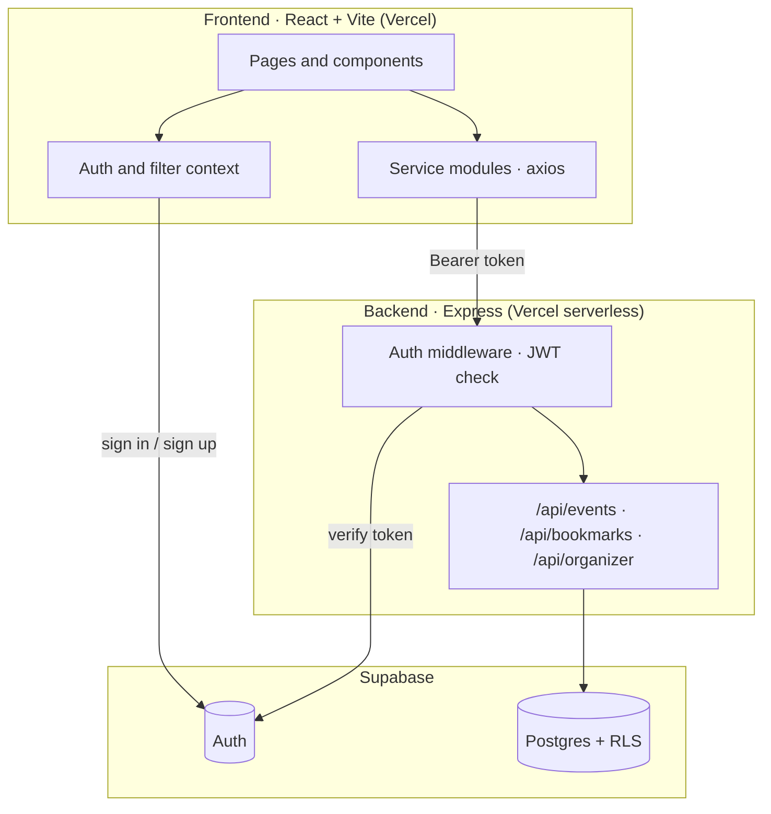

<div align="center">

# 📍 Madurai EventSphere

**Discover events. Find your community. Build something in Madurai.**

A local event discovery platform for students, founders, and organizers — bringing hackathons, workshops, bootcamps, meetups, and community events into one place.

[](https://frontendmadurai-e<div align="center">

# 📍 Madurai EventSphere

**Discover events. Find your community. Build something in Madurai.**

A local event discovery platform for students, founders, and organizers — bringing hackathons, workshops, bootcamps, meetups, and community events into one place.

[](https://frontendmadurai-eventsphere.vercel.app/)
[](https://github.com/SELVA-MEENAKSHI-K/frontendmadurai-eventsphere)


[**Live app**](https://frontendmadurai-eventsphere.vercel.app/) · [**Report a bug**](https://github.com/SELVA-MEENAKSHI-K/frontendmadurai-eventsphere/issues) · [**Request a feature**](https://github.com/SELVA-MEENAKSHI-K/frontendmadurai-eventsphere/issues)

</div>

---

## Table of Contents

- [Why EventSphere?](#why-eventsphere)
- [Highlights](#highlights)
- [What You Can Do](#what-you-can-do)
- [How It Works](#how-it-works)
- [Architecture](#architecture)
- [Kiro University Lessons](#kiro-university-lessons)
- [Technology](#technology)
- [Project Structure](#project-structure)
- [Getting Started](#getting-started)
- [Configuration](#configuration)
- [API Reference](#api-reference)
- [Testing](#testing)
- [Deployment](#deployment)
- [Accessibility](#accessibility)
- [Roadmap](#roadmap)
- [Contributing](#contributing)
- [Author](#author)

## Why EventSphere?

Event information is often scattered across social media, college groups, and organizer pages. Students may miss useful opportunities, while organizers need a straightforward way to share events with the local community.

Madurai EventSphere brings event discovery and organizer workflows together. It helps people find relevant events, understand the details, save opportunities, and keep track of their participation.

## Highlights

| | |
|---|---|
| 🔎 **Smart discovery** | Search plus filters for category, domain, area and date range |
| 🗺️ **Map view** | Leaflet map with colour-coded category markers |
| 🔖 **Bookmarks** | Save events and revisit them from a protected page |
| 🛠️ **Organizer tools** | Create, edit, publish and manage your own events |
| 🔐 **Role-based access** | Student and organizer roles enforced on routes and on the API |
| 🧪 **Correctness first** | Property-based tests (fast-check) for filters, dates and map logic |
| 🤖 **Kiro-powered** | Specs, steering, hooks, MCP, custom agents and a packaged Power drive the workflow |
| 📱 **Mobile-first** | Responsive layouts designed for phones first |

> 📸 **Screenshots:** add images to a `docs/screenshots/` folder and link them here (home page, event detail, map view, organizer dashboard).

## What You Can Do

### Discover events

- Browse and search event listings.
- Filter events by category, domain, area, and date.
- Open an event to see its description, venue, eligibility, deadline, and registration information.
- Explore events in a calendar.
- View event locations on a map when location coordinates are available.
- Add an event to your own calendar and share it with friends.

### Keep track of events

- Sign in or create an account.
- Bookmark events for later.
- View saved events on a protected bookmarks page.
- View and update profile information.
- Review event registrations.

### Publish and manage events

- Open the organizer dashboard.
- Create an event with its details and location.
- Edit an existing event.
- Manage event publishing through organizer tools.

### Explore with demo data

Sample Madurai events and demo flows help people explore the application when live backend services are unavailable or not configured. Demo data is intended for demonstration and does not guarantee that changes are saved to the production API.

## How It Works



The frontend uses page components for the user interface and service modules for API communication. Authentication state is shared through the application context. Protected routes check whether a user is signed in, and organizer routes additionally check the user's role.

## Architecture



Key design decisions:

- **The browser never sees the service-role key.** Only the backend uses it; the frontend uses the public anon key for auth.
- **Ownership is enforced on the server.** `organizer_id` always comes from the verified token, never from the request body.
- **Events are draft-first.** Only published events are visible to the public.

## Kiro University Lessons

These are the Kiro University Challenge lesson names and how their capabilities connect to Madurai EventSphere. Lesson identifiers here follow the official challenge syllabus, not the project's internal T3/T4 task IDs.

| Kiro lesson | Official lesson name | How the project uses it | Relevant project files |
|---|---|---|---|
| Lesson 1 | Spec-driven development | The EventSphere requirements, design, and task breakdown describe what to build before implementation. They connect event discovery, attendee flows, and organizer workflows to planned requirements and tasks. | `.kiro/specs/madurai-eventsphere/requirements.md`; `.kiro/specs/madurai-eventsphere/design.md`; `.kiro/specs/madurai-eventsphere/tasks.md` |
| Lesson 2 | Steering documents | Project-wide coding standards guide Kiro when it edits React, API, and utility code, including component conventions, Tailwind usage, shared API services, and accessibility expectations. | `.kiro/steering/coding-standards.md` |
| Lesson 3 | Hooks | Project hooks automate review/support steps during Kiro work. The EventSphere task reviewer checks completed spec tasks against requirements and suggests relevant property-based tests; the Kironomics hook supports session/tool tracking. | `.kiro/hooks/eventsphere-task-review.json`; `.kiro/hooks/kironomics.json` |
| Lesson 4 | Property-based testing (PBT) | Generative tests use fast-check to check reusable properties across many generated inputs, including event date formatting and filter behavior, rather than relying only on a few hand-picked examples. | `src/utils/__tests__/pbt.generative.test.js`; requirements referenced in `.kiro/specs/madurai-eventsphere/requirements.md` |
| Lesson 5 | MCP | Kiro's MCP configuration connects the project session to the hosted Supabase MCP server, making project data tools available to Kiro during development. | `.kiro/settings/mcp.json` |
| Lesson 6 | Custom agents | Focused frontend and backend agents give Kiro role-specific instructions, tools, and file boundaries for work on the React application and Express API. | `.kiro/agents/frontend-dev.json`; `.kiro/agents/backend-dev.json` |
| Lesson 7 | Powers | The EventSphere Power provides reusable project guidance and development conventions that Kiro can load when relevant to an EventSphere task. | `powers/eventsphere-helper/POWER.md`; `powers/eventsphere-helper/plugin.json`; `powers/eventsphere-helper/skills/event-development/SKILL.md` |
| Bonus 1 | Kiro Web and cloud sessions | This bonus concerns working on the same project through Kiro's browser-based cloud session. It changes the development workflow rather than adding an application feature; the repository's `.kiro/` configuration supplies project context. | No application source file; project context is in `.kiro/` and the GitHub repository. |
| Bonus 2 | Package a Kiro Power | The EventSphere project guidance is arranged as a reusable Power package, with metadata and a skill file that explains when and how to apply the project conventions. | `powers/eventsphere-helper/POWER.md`; `powers/eventsphere-helper/plugin.json`; `powers/eventsphere-helper/skills/event-development/SKILL.md` |

## Technology

| Area | Tools |
|---|---|
| Frontend | React 18, Vite, Tailwind CSS |
| Routing | React Router |
| Authentication and data | Supabase |
| Backend | Node.js, Express |
| Maps | Leaflet, React Leaflet |
| HTTP client | Axios |
| Notifications | `react-hot-toast` |
| Page metadata | `react-helmet-async` |
| Testing | Vitest, fast-check (property-based testing) |
| Hosting | Vercel |

## Project Structure

```text
frontendmadurai-eventsphere/
├── .kiro/                    # Specs, steering, hooks and agents
├── backend/                  # Express API
│   ├── api/                  # Vercel serverless entry point
│   └── src/                  # Routes, middleware, Supabase client
├── powers/
│   └── eventsphere-helper/   # Kiro Power package
├── src/
│   ├── components/           # Shared UI and event components
│   ├── context/              # Shared authentication state
│   ├── data/                 # Sample event data
│   ├── hooks/                # Reusable React hooks
│   ├── pages/                # Application pages and routes
│   ├── services/             # API communication
│   └── utils/                # Shared utilities (dates, map, validation)
├── vercel.json               # Client-side route fallback
└── README.md
```

## Getting Started

### Prerequisites

- Node.js 18 or newer
- A free [Supabase](https://supabase.com/) project (for live auth and data)

### 1. Clone the repository

```bash
git clone https://github.com/SELVA-MEENAKSHI-K/frontendmadurai-eventsphere.git
cd frontendmadurai-eventsphere
```

### 2. Run the frontend

Run these commands from the repository root:

```bash
cp .env.example .env      # then fill in your values
npm install
npm run dev
```

The app starts at `http://localhost:5173`.

### 3. Run the backend

```bash
cd backend
cp .env.example .env      # then fill in your values
npm install
npm run dev
```

The API starts at `http://localhost:3001`. Check it with `GET /api/health`.

### Available scripts

| Where | Command | What it does |
|---|---|---|
| Root | `npm run dev` | Start the Vite dev server |
| Root | `npm run build` | Create a production build |
| Root | `npm run preview` | Preview the production build locally |
| Root | `npm test` | Run the test suite once |
| Root | `npm run test:watch` | Run tests in watch mode |
| `backend/` | `npm run dev` | Start the API with auto-restart |
| `backend/` | `npm start` | Start the API |

## Configuration

Keep credentials and private keys in local environment files or the deployment provider's environment settings. **Never commit secret keys to the repository.**

### Frontend (`.env`)

| Variable | Description |
|---|---|
| `VITE_API_BASE_URL` | URL of the backend API, e.g. `http://localhost:3001` |
| `VITE_SUPABASE_URL` | Your Supabase project URL |
| `VITE_SUPABASE_ANON_KEY` | Supabase **anon** (public) key |

### Backend (`backend/.env`)

| Variable | Description |
|---|---|
| `SUPABASE_URL` | Your Supabase project URL |
| `SUPABASE_SERVICE_ROLE_KEY` | Supabase **service-role** key — server only, keep it secret |
| `PORT` | API port (default `3001`) |

Live application features depend on valid Supabase configuration, a reachable backend API, and matching frontend API settings. Without those services, sample data may be available for exploration, but backend changes may not persist.

## API Reference

All responses use the shape `{ success: boolean, data?, error? }`. Routes marked 🔒 need an `Authorization: Bearer <token>` header.

| Method | Endpoint | Access | Description |
|---|---|---|---|
| `GET` | `/api/health` | Public | Health check |
| `GET` | `/api/events` | Public | List published events. Query: `category`, `domain`, `micro_location`, `date_from`, `date_to`, `search` |
| `GET` | `/api/events/:id` | Public | Event details with organizer info |
| `POST` | `/api/events` | 🔒 Organizer | Create an event |
| `PUT` | `/api/events/:id` | 🔒 Owner | Update an event |
| `DELETE` | `/api/events/:id` | 🔒 Owner | Delete an event |
| `GET` | `/api/bookmarks` | 🔒 User | List your bookmarks |
| `POST` | `/api/bookmarks` | 🔒 User | Bookmark an event |
| `DELETE` | `/api/bookmarks/:event_id` | 🔒 User | Remove a bookmark |
| `GET` | `/api/organizer/events` | 🔒 Organizer | Your events (drafts and published) with stats |
| `PUT` | `/api/organizer/events/:id/publish` | 🔒 Owner | Toggle published / draft |

## Testing

```bash
npm test
```

EventSphere uses **property-based testing** with [fast-check](https://fast-check.dev/) alongside regular unit tests, so rules like "a filter never returns an event that does not match" are checked against many generated inputs, not just a few hand-written examples.

Covered areas include date and deadline helpers, category and domain constants, map utilities, and event filter parameter building.

> Backend tests need the backend dependencies installed first: run `npm install` inside `backend/`.

## Deployment

The frontend is deployed through Vercel and connected to the GitHub repository. The root `vercel.json` provides a fallback for client-side routes, allowing paths such as `/login`, `/register`, and `/calendar` to load directly.

The backend is an Express app with a Vercel serverless entry point (`backend/api/index.js`). To go live with authentication and the API:

1. Deploy the `backend/` folder as its own Vercel project and set `SUPABASE_URL` and `SUPABASE_SERVICE_ROLE_KEY`.
2. In the frontend Vercel project, set `VITE_API_BASE_URL` to the deployed backend URL, plus the two `VITE_SUPABASE_*` variables.
3. Redeploy the frontend so the new variables are picked up.

## Accessibility

EventSphere aims to support responsive layouts, labeled controls, keyboard navigation, and clear loading, error, and empty states. Color contrast and assistive-technology behavior should be checked in the running application before claiming full WCAG conformance.

## Roadmap

- [ ] Email or push reminders before registration deadlines
- [ ] Admin moderation for submitted events
- [ ] Organizer analytics (views, saves, registrations over time)
- [ ] Interactive location picker for organizers
- [ ] Tamil language support
- [ ] Dark mode

## Contributing

Contributions are welcome.

1. Fork the repository and create a branch: `git checkout -b feature/your-feature`
2. Make your changes and run `npm test` and `npm run build`
3. Commit with a clear message and open a pull request describing what changed and why

For larger changes, please open an issue first so we can discuss the approach.

## Author

**Selva Meenakshi K** — B.Sc. Computer Science, Thiagarajar College of Arts and Science, Madurai

[GitHub](https://github.com/SELVA-MEENAKSHI-K) · [LinkedIn](https://www.linkedin.com/in/selva-meenakshi-k)

---

<div align="center">

Madurai EventSphere is built around a simple goal: make local opportunities easier to discover and share. By connecting attendees with organizers, the platform can help more people take part in learning, networking, and innovation events across Madurai.

⭐ If this project helps you, consider giving it a star.

</div>ventsphere.vercel.app/)
[](https://github.com/SELVA-MEENAKSHI-K/frontendmadurai-eventsphere)


[**Live app**](https://frontendmadurai-eventsphere.vercel.app/) · [**Report a bug**](https://github.com/SELVA-MEENAKSHI-K/frontendmadurai-eventsphere/issues) · [**Request a feature**](https://github.com/SELVA-MEENAKSHI-K/frontendmadurai-eventsphere/issues)

</div>

---

## Table of Contents

- [Why EventSphere?](#why-eventsphere)
- [Highlights](#highlights)
- [What You Can Do](#what-you-can-do)
- [How It Works](#how-it-works)
- [Architecture](#architecture)
- [Kiro University Lessons](#kiro-university-lessons)
- [Technology](#technology)
- [Project Structure](#project-structure)
- [Getting Started](#getting-started)
- [Configuration](#configuration)
- [API Reference](#api-reference)
- [Testing](#testing)
- [Deployment](#deployment)
- [Accessibility](#accessibility)
- [Roadmap](#roadmap)
- [Contributing](#contributing)
- [Author](#author)

## Why EventSphere?

Event information is often scattered across social media, college groups, and organizer pages. Students may miss useful opportunities, while organizers need a straightforward way to share events with the local community.

Madurai EventSphere brings event discovery and organizer workflows together. It helps people find relevant events, understand the details, save opportunities, and keep track of their participation.

## Highlights

| | |
|---|---|
| 🔎 **Smart discovery** | Search plus filters for category, domain, area and date range |
| 🗺️ **Map view** | Leaflet map with colour-coded category markers |
| 🔖 **Bookmarks** | Save events and revisit them from a protected page |
| 🛠️ **Organizer tools** | Create, edit, publish and manage your own events |
| 🔐 **Role-based access** | Student and organizer roles enforced on routes and on the API |
| 🧪 **Correctness first** | Property-based tests (fast-check) for filters, dates and map logic |
| 🤖 **Kiro-powered** | Specs, steering, hooks and a custom Power drive the workflow |
| 📱 **Mobile-first** | Responsive layouts designed for phones first |

> 📸 **Screenshots:** add images to a `docs/screenshots/` folder and link them here (home page, event detail, map view, organizer dashboard).

## What You Can Do

### Discover events

- Browse and search event listings.
- Filter events by category, domain, area, and date.
- Open an event to see its description, venue, eligibility, deadline, and registration information.
- Explore events in a calendar.
- View event locations on a map when location coordinates are available.
- Add an event to your own calendar and share it with friends.

### Keep track of events

- Sign in or create an account.
- Bookmark events for later.
- View saved events on a protected bookmarks page.
- View and update profile information.
- Review event registrations.

### Publish and manage events

- Open the organizer dashboard.
- Create an event with its details and location.
- Edit an existing event.
- Manage event publishing through organizer tools.

### Explore with demo data

Sample Madurai events and demo flows help people explore the application when live backend services are unavailable or not configured. Demo data is intended for demonstration and does not guarantee that changes are saved to the production API.

## How It Works


The frontend uses page components for the user interface and service modules for API communication. Authentication state is shared through the application context. Protected routes check whether a user is signed in, and organizer routes additionally check the user's role.

## Architecture


Key design decisions:

- **The browser never sees the service-role key.** Only the backend uses it; the frontend uses the public anon key for auth.
- **Ownership is enforced on the server.** `organizer_id` always comes from the verified token, never from the request body.
- **Events are draft-first.** Only published events are visible to the public.

## Kiro University Lessons

The lessons below are mapped to the EventSphere features and development workflows they relate to.

| Lesson | Lesson name | How it connects to EventSphere | Project folder / relevant files |
|---|---|---|---|
| T3-01 | User Profiles and Signup Trigger | Supabase authentication identifies users, while profile data stores information used by the application. The `handle_new_user` database trigger is intended to create a profile record when a user signs up, connecting account creation with the app's user-profile workflow. | `src/context/` for authentication and profile flows; Supabase Dashboard → SQL Editor for the database trigger. |
| T3-02 | Login and Registration | Login and registration pages collect credentials and connect to the authentication context. After login, the app can return a user to the protected page they originally tried to open. | `src/pages/` (`LoginPage.jsx`, `RegisterPage.jsx`); `src/App.jsx`; `src/context/`. |
| T3-03 | Authenticated API Requests | The shared Supabase client reads the current session. The API client uses the session token on protected requests so the backend can identify the signed-in user. | `src/services/` (`api.js`, shared Supabase client); `backend/src/middleware/` (authentication middleware). |
| T3-04 | Event Bookmarks | The bookmark service communicates with the bookmark API, while the `useBookmarks` hook provides bookmark data and actions to pages and event cards. Signed-in users can save events, remove saved events, and view their bookmarks. | `src/services/bookmarkService.js`; `src/hooks/useBookmarks.js`; `src/pages/BookmarksPage.jsx`; `src/components/events/`; `backend/src/routes/bookmarks.js`. |
| T4-01 | Organizer Event Creation | The event form gathers event information and validates the input. The location picker supports adding coordinates, and the organizer route restricts event creation to users with the organizer role. | `src/pages/` (organizer event page); `src/components/organizer/`; `src/services/organizerService.js`; `src/utils/` (validation and calendar utilities). |
| T4-03 | Organizer Event Editing | Organizers can load an existing event into the editing flow and submit updated details through the event service. Ownership checks are used to limit editing to the event's organizer. | `src/pages/` (event editing page); `src/components/organizer/`; `src/services/organizerService.js`; `backend/src/routes/`. |
| T4-05 | Backend Deployment | The Express API provides the server side for event, bookmark, and organizer workflows. The deployed frontend needs the production API URL and Supabase settings to use live backend features. | `backend/` (Express app and deployment configuration); Vercel project environment settings for production variables. |
| Bonus | Package a Kiro Power | The `eventsphere-helper` Power packages project-specific development guidance so it can be installed and reused while working on EventSphere. | `powers/eventsphere-helper/` (`POWER.md`, `plugin.json`, `README.md`, and `skills/event-development/SKILL.md`). |

## Technology

| Area | Tools |
|---|---|
| Frontend | React 18, Vite, Tailwind CSS |
| Routing | React Router |
| Authentication and data | Supabase |
| Backend | Node.js, Express |
| Maps | Leaflet, React Leaflet |
| HTTP client | Axios |
| Notifications | `react-hot-toast` |
| Page metadata | `react-helmet-async` |
| Testing | Vitest, fast-check (property-based testing) |
| Hosting | Vercel |

## Project Structure

```text
frontendmadurai-eventsphere/
├── .kiro/                    # Specs, steering, hooks and agents
├── backend/                  # Express API
│   ├── api/                  # Vercel serverless entry point
│   └── src/                  # Routes, middleware, Supabase client
├── powers/
│   └── eventsphere-helper/   # Kiro Power package
├── src/
│   ├── components/           # Shared UI and event components
│   ├── context/              # Shared authentication state
│   ├── data/                 # Sample event data
│   ├── hooks/                # Reusable React hooks
│   ├── pages/                # Application pages and routes
│   ├── services/             # API communication
│   └── utils/                # Shared utilities (dates, map, validation)
├── vercel.json               # Client-side route fallback
└── README.md
```

## Getting Started

### Prerequisites

- Node.js 18 or newer
- A free [Supabase](https://supabase.com/) project (for live auth and data)

### 1. Clone the repository

```bash
git clone https://github.com/SELVA-MEENAKSHI-K/frontendmadurai-eventsphere.git
cd frontendmadurai-eventsphere
```

### 2. Run the frontend

Run these commands from the repository root:

```bash
cp .env.example .env      # then fill in your values
npm install
npm run dev
```

The app starts at `http://localhost:5173`.

### 3. Run the backend

```bash
cd backend
cp .env.example .env      # then fill in your values
npm install
npm run dev
```

The API starts at `http://localhost:3001`. Check it with `GET /api/health`.

### Available scripts

| Where | Command | What it does |
|---|---|---|
| Root | `npm run dev` | Start the Vite dev server |
| Root | `npm run build` | Create a production build |
| Root | `npm run preview` | Preview the production build locally |
| Root | `npm test` | Run the test suite once |
| Root | `npm run test:watch` | Run tests in watch mode |
| `backend/` | `npm run dev` | Start the API with auto-restart |
| `backend/` | `npm start` | Start the API |

## Configuration

Keep credentials and private keys in local environment files or the deployment provider's environment settings. **Never commit secret keys to the repository.**

### Frontend (`.env`)

| Variable | Description |
|---|---|
| `VITE_API_BASE_URL` | URL of the backend API, e.g. `http://localhost:3001` |
| `VITE_SUPABASE_URL` | Your Supabase project URL |
| `VITE_SUPABASE_ANON_KEY` | Supabase **anon** (public) key |

### Backend (`backend/.env`)

| Variable | Description |
|---|---|
| `SUPABASE_URL` | Your Supabase project URL |
| `SUPABASE_SERVICE_ROLE_KEY` | Supabase **service-role** key — server only, keep it secret |
| `PORT` | API port (default `3001`) |

Live application features depend on valid Supabase configuration, a reachable backend API, and matching frontend API settings. Without those services, sample data may be available for exploration, but backend changes may not persist.

## API Reference

All responses use the shape `{ success: boolean, data?, error? }`. Routes marked 🔒 need an `Authorization: Bearer <token>` header.

| Method | Endpoint | Access | Description |
|---|---|---|---|
| `GET` | `/api/health` | Public | Health check |
| `GET` | `/api/events` | Public | List published events. Query: `category`, `domain`, `micro_location`, `date_from`, `date_to`, `search` |
| `GET` | `/api/events/:id` | Public | Event details with organizer info |
| `POST` | `/api/events` | 🔒 Organizer | Create an event |
| `PUT` | `/api/events/:id` | 🔒 Owner | Update an event |
| `DELETE` | `/api/events/:id` | 🔒 Owner | Delete an event |
| `GET` | `/api/bookmarks` | 🔒 User | List your bookmarks |
| `POST` | `/api/bookmarks` | 🔒 User | Bookmark an event |
| `DELETE` | `/api/bookmarks/:event_id` | 🔒 User | Remove a bookmark |
| `GET` | `/api/organizer/events` | 🔒 Organizer | Your events (drafts and published) with stats |
| `PUT` | `/api/organizer/events/:id/publish` | 🔒 Owner | Toggle published / draft |

## Testing

```bash
npm test
```

EventSphere uses **property-based testing** with [fast-check](https://fast-check.dev/) alongside regular unit tests, so rules like "a filter never returns an event that does not match" are checked against many generated inputs, not just a few hand-written examples.

Covered areas include date and deadline helpers, category and domain constants, map utilities, and event filter parameter building.

> Backend tests need the backend dependencies installed first: run `npm install` inside `backend/`.

## Deployment

The frontend is deployed through Vercel and connected to the GitHub repository. The root `vercel.json` provides a fallback for client-side routes, allowing paths such as `/login`, `/register`, and `/calendar` to load directly.

The backend is an Express app with a Vercel serverless entry point (`backend/api/index.js`). To go live with authentication and the API:

1. Deploy the `backend/` folder as its own Vercel project and set `SUPABASE_URL` and `SUPABASE_SERVICE_ROLE_KEY`.
2. In the frontend Vercel project, set `VITE_API_BASE_URL` to the deployed backend URL, plus the two `VITE_SUPABASE_*` variables.
3. Redeploy the frontend so the new variables are picked up.

## Accessibility

EventSphere aims to support responsive layouts, labeled controls, keyboard navigation, and clear loading, error, and empty states. Color contrast and assistive-technology behavior should be checked in the running application before claiming full WCAG conformance.

## Roadmap

- [ ] Email or push reminders before registration deadlines
- [ ] Admin moderation for submitted events
- [ ] Organizer analytics (views, saves, registrations over time)
- [ ] Interactive location picker for organizers
- [ ] Tamil language support
- [ ] Dark mode

## Contributing

Contributions are welcome.

1. Fork the repository and create a branch: `git checkout -b feature/your-feature`
2. Make your changes and run `npm test` and `npm run build`
3. Commit with a clear message and open a pull request describing what changed and why

For larger changes, please open an issue first so we can discuss the approach.

## Author

**Selva Meenakshi K** — B.Sc. Computer Science, Thiagarajar College of Arts and Science, Madurai

[GitHub](https://github.com/SELVA-MEENAKSHI-K) · [LinkedIn](https://www.linkedin.com/in/selva-meenakshi-k)

---

<div align="center">

Madurai EventSphere is built around a simple goal: make local opportunities easier to discover and share. By connecting attendees with organizers, the platform can help more people take part in learning, networking, and innovation events across Madurai.

⭐ If this project helps you, consider giving it a star.

</div>
